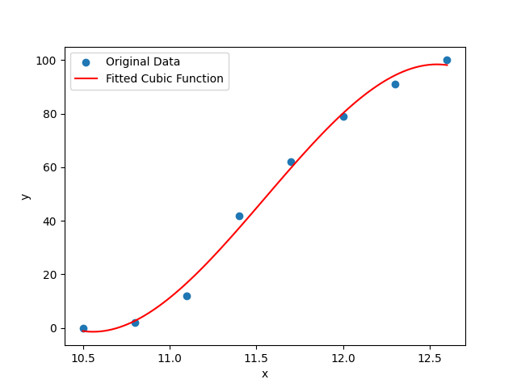
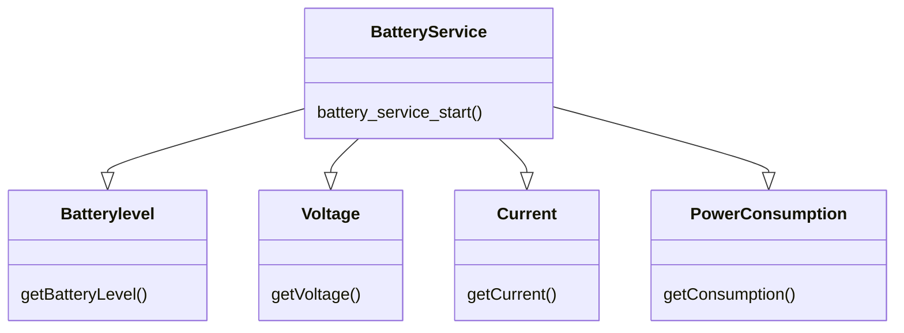

# Battery Level
## 1. Battery
The PiRacer is using three Sanyo 18650 2600mAh lithium-ion batteries. The State of Charge (SOC) of a lithium-ion battery is a complex function. The Motherboard of the PiRacer only has the current Voltage of the battery. Therefore a voltage to battery function has to get implemented. The maximum Battery voltage is 12,6 V and the minimum voltage is 10.5V. These values were measured in [this paper [1]](https://lygte-info.dk/info/BatteryChargePercent%20UK.html). Also this paper measured voltages to battery level to interpolate a suitable function, see next part. Problematic for the battery level is the voltage level which fluctuates depending on the power consumption. Which means the battery level will drop sharply if the motors are using full power. Also the voltage will rise slightly after the power consumption drops to 0. This results in inaccurate battery level display.

## 2. Battery Level Interpolation
The battery level can be interpolated with measured voltages from [this paper [1]](https://lygte-info.dk/info/BatteryChargePercent%20UK.html). 

| Voltage [V]| Voltage [V] x3 | Batterylevel [%] | 
|:--:|:--:|:--:|
| 4.2 | 12.6 | 100 | 
| 4.1 | 12.3 | 91 | 
| 4.0 | 12 | 79 | 
| 3.9 | 11.7 | 62 | 
| 3.8 | 11.4 | 42 | 
| 3.7 | 11.1 | 12 | 
| 3.6 | 10.8 | 2 | 
| 3.5 | 10.5 | 0 | 

The function to estimate the discharging can be approximated by a third-degree polynomial function.

~~~python
import numpy as np
from scipy.optimize import curve_fit
import matplotlib.pyplot as plt

# Given data
data = np.array([
       [10.5,   0. ],
       [10.8,   2. ],
       [11.1,  12. ],
       [11.4,  42. ],
       [11.7,  62. ],
       [12. ,  79. ],
       [12.3,  91. ],
       [12.6, 100. ]])

# Define the cubic function
def cubic_function(x, a, b, c, d):
    return a * x**3 + b * x**2 + c * x + d

# Fit the curve to the data
params, covariance = curve_fit(cubic_function, data[:, 0], data[:, 1])

# Extract the parameters
a, b, c, d = params

# Generate points for the fitted curve
x_values = np.linspace(min(data[:, 0]), max(data[:, 0]), 100)
y_values = cubic_function(x_values, a, b, c, d)

# Plot the original data and the fitted curve
plt.scatter(data[:, 0], data[:, 1], label='Original Data')
plt.plot(x_values, y_values, label='Fitted Cubic Function', color='red')
plt.xlabel('x')
plt.ylabel('y')
plt.legend()
plt.show()

# Display the parameters of the fitted cubic function
print(f'The fitted cubic function is: y = {a:.4f} * x^3 + {b:.4f} * x^2 + {c:.4f} * x + {d:.4f}')
~~~

The next picture displays the resulting function for the voltage to battery level conversion with this  function.
$$
y(x) = -25.6269 \cdot x^3 + 887.9706 \cdot x^2 - 10180.5203 \cdot x + 38661.8396 
$$

## 3. Calculate Battery Level
To calculate the battery level the current battery voltage is requested. In order to reduce inaccuracies, the measured values ​​are given a moving average of 5 values. With the above formula the battery level can be calculated.

## 4. Send Data via DBus
To send the data via Dbus, a DBus Object has to be created. In the battery_service_start() function the Session DBus gets published.

### <u>Source</u>
[[1] Estimating remaning capacity in Li-Ion batteries](https://lygte-info.dk/info/BatteryChargePercent%20UK.html)
