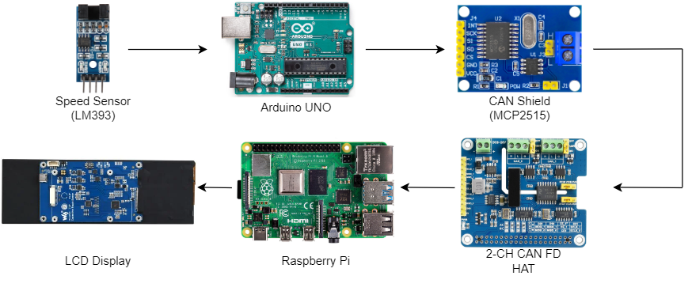
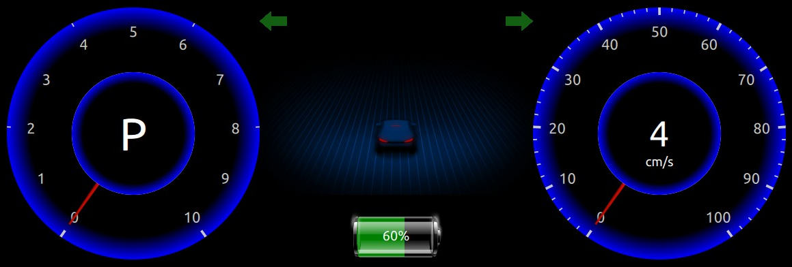

# DES Project - Instrument Cluster
The PiRacer instrument cluster Qt application project is aimed at creating a real-time speedometer for a PiRacer car. The application will run on a Raspberry Pi and receive speed data from a speed sensor via the in-vehicle communication using Controller Area Network (CAN) protocol

## Goals and Objectives

The main goal of the PiRacer Instrument Cluster Qt Application project is to create a functioning instrument cluster for a PiRacer car that displays real-time speed data from a speed sensor via CAN bus

1. To design and implement a Qt-based graphical user interface (GUI) for the instrument cluster
2. To integrate an arduino based speed sensor system with the Raspberry Pi using the CAN bus protocol
3. To display real-time speed data on the instrument cluster GUI
4. To display battery level of PiRacer on Instrument Cluster

## Hardware Requirements
- PiRacer Kit
- Joystick
- Speed Sensor (LM393)
- Arduino UNO
- CAN Shield (MCP2515)
- 2-CH CAN FD HAT
- Raspberry Pi 4
- 7.9inch DSI LCD Display
- Jumper wires, USB cable for Arduino

## Hardware Connection

## Software Stack
1. Tools
    - Ras-pi Imager
    - Arduino IDE
    - Visual Studio Code
    - Qt Creator

2. Languages
    - Arduino Sketch
    - C++
    - Python
    - Qml

## Result
